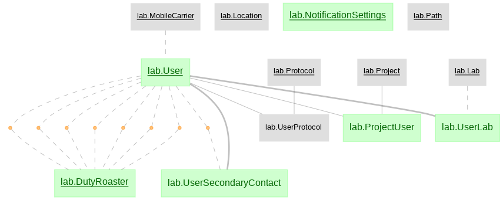
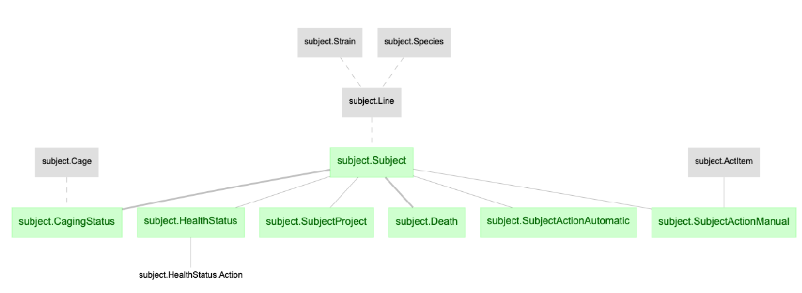

# U19-pipeline_python

The python data pipeline defined with DataJoint for U19 projects

The data pipeline is mainly ingested and maintained with the matlab repository: https://github.com/shenshan/U19-pipeline-matlab

This repository is the mirrored table definitions for the tables.

## Major schemas

Currently, the main schemas in the data pipeline are as follows:

-  lab



-  reference


- subject



- action


- acquisition


- task


- behavior


## Installation of package for usage and development.

To use and contribute to the developement of the package, we recommend either using a Docker setup or creating a virtual environment, as follows:

1. In either way, we first clone the directory `git clone https://github.com/BrainCOGS/U19-pipeline_python`

2. To use a docker setup, after installing docker, inside this directory, we

> *  set up the `.env` file, as follows:
```
DJ_HOST = 'datajoint00.pni.princeton.edu'
DJ_USER = {your_user_name}
DJ_PASSWORD = {your_password}
```
> *  run `docker-compose up -d`

> * Then, we could run `docker exec -it u19_pipeline_python_datajoint_1 /bin/bash`
This will provide you a mini environment to work with python.

3. To use a virtual environment setup, we could

> * install `virtualenv` by `pip3 install virtualenv`

> * Create a virtual environment by 'virtualenv princeton_env'

> * Activate the virtual environment by `source princeton_env/bin/activate`

> * With the virtual environment, we could install the package that allows edits: `pip3 install .`
